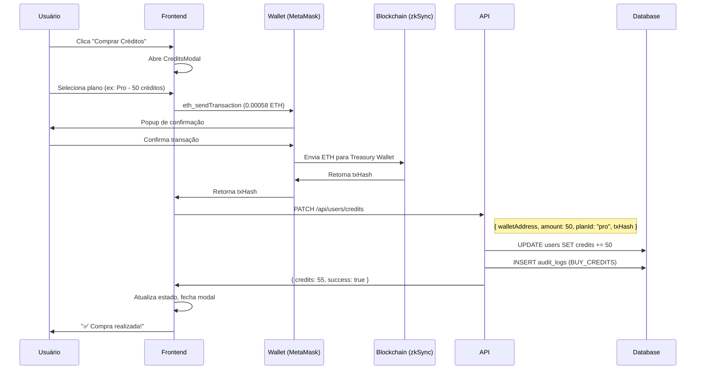
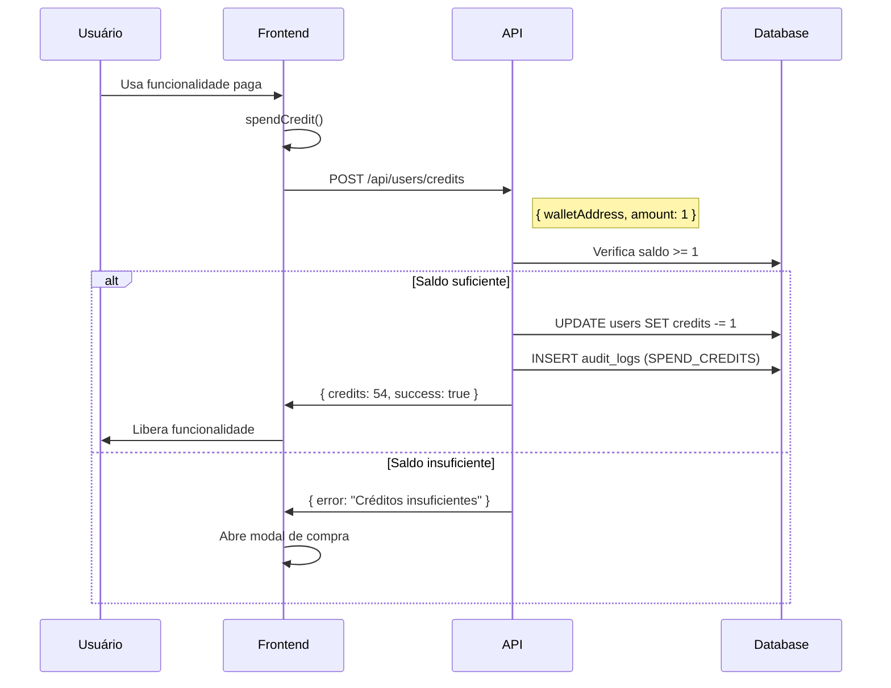

# Fluxo de Créditos - Lake Tokeniza

## Visão Geral

O sistema de créditos permite que usuários comprem pacotes de créditos via transação blockchain (zkSync Era) e os utilizem para acessar funcionalidades premium da plataforma.

## Arquitetura

```
┌─────────────────┐     ┌─────────────────┐     ┌─────────────────┐
│   Frontend      │     │   API Routes    │     │   PostgreSQL    │
│   (React)       │────▶│   (Next.js)     │────▶│   (Supabase)    │
└────────┬────────┘     └─────────────────┘     └─────────────────┘
         │
         │ eth_sendTransaction
         ▼
┌─────────────────┐
│   zkSync Era    │
│   (Blockchain)  │
└─────────────────┘
```

## Componentes Principais

### 1. CreditsContext (`context/credits-context.tsx`)

Gerencia o estado global de créditos:

- `credits`: Saldo atual do usuário
- `buyCredits(plan)`: Compra créditos via blockchain + API
- `spendCredit()`: Gasta 1 crédito
- `refreshCredits()`: Sincroniza saldo com banco
- `openModal()` / `closeModal()`: Controla o modal de compra

### 2. CreditsModal (`components/CreditsModal.tsx`)

Interface de compra com 4 planos:

| Plano   | Créditos | Preço ETH  | Preço USDT |
|---------|----------|------------|------------|
| Trial   | 5        | 0.00012    | ~$0.35     |
| Starter | 10       | 0.00038    | ~$1.15     |
| Pro     | 50       | 0.00058    | ~$1.75     |
| Expert  | 100      | 0.00116    | ~$3.00     |

### 3. API Routes (`app/api/users/credits/route.ts`)

| Método | Função | Body |
|--------|--------|------|
| GET    | Buscar saldo | `?wallet=0x...` |
| PATCH  | Adicionar créditos | `{ walletAddress, amount, planId, txHash }` |
| POST   | Gastar crédito | `{ walletAddress, amount }` |

## Fluxo de Compra



## Fluxo de Gasto



## Tabelas Envolvidas

### users
```sql
credits INT DEFAULT 5  -- Saldo de créditos
```

### audit_logs
```sql
action VARCHAR     -- "BUY_CREDITS" ou "SPEND_CREDITS"
metadata JSON      -- { planId, credits, txHash, previousBalance, newBalance }
```

## Treasury Wallet

Endereço para receber pagamentos:
```
0xa56d035c92B479c49Be359496564a8A598716ec4
```

Configurável via variável de ambiente:
```env
NEXT_PUBLIC_TREASURY_WALLET=0x...
```

## Considerações de Segurança

1. **Validação de Wallet**: Todas as operações verificam `walletAddress` normalizado
2. **Fail-Safe**: Saldo insuficiente retorna erro antes de debitar
3. **Audit Trail**: Toda operação é registrada em `audit_logs`
4. **Transação On-Chain**: Compra só é creditada após txHash confirmado
